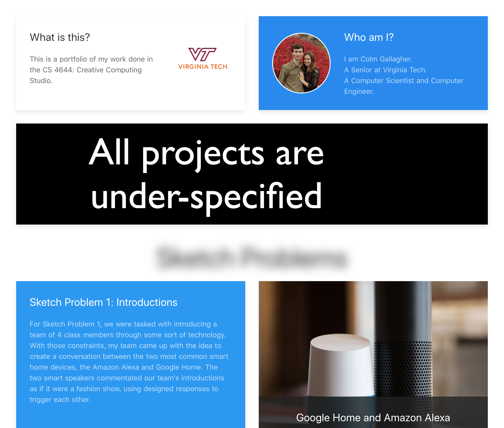

# Capstone Portfolio

Website: [https://mecolmg.github.io/capstone-portfolio/](https://mecolmg.github.io/capstone-portfolio/)

> Portfolio of work done by Colm Gallagher in Creative Computing Studio Capstone at Virginia Tech



## Build Setup

``` bash
# install dependencies
$ npm install # Or yarn install

# serve with hot reload at localhost:3000
$ npm run dev

# build for production and launch server
$ npm run build
$ npm start

# generate static project
$ npm run generate
```

For detailed explanation on how things work, checkout the [Nuxt.js docs](https://github.com/nuxt/nuxt.js).

## Made With

- Vue
- Nuxt
- UIkit
- Coffee ☕
- Beer 🍺
